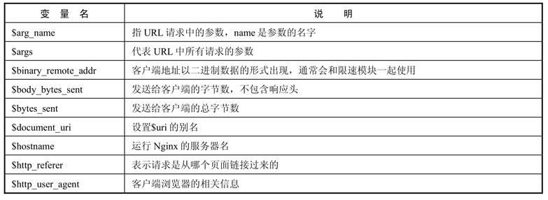
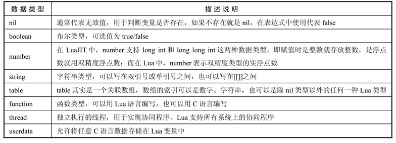
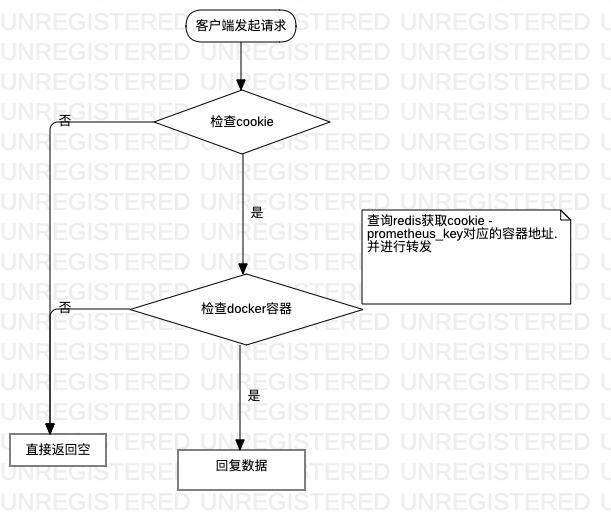
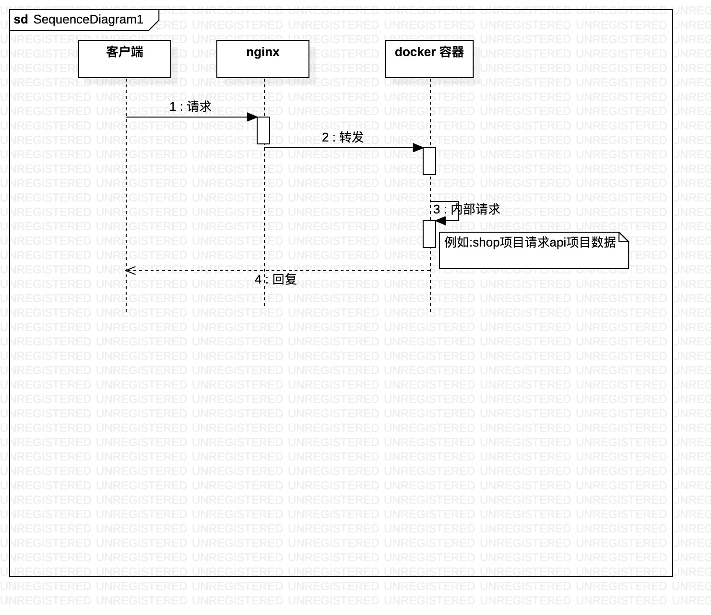
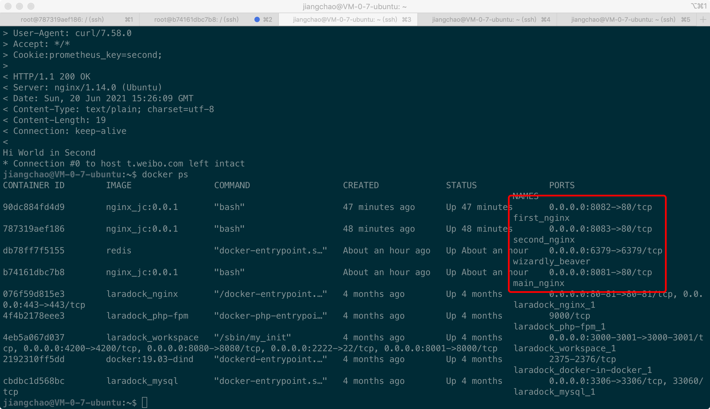

# Nginx + Lua介绍

## Nginx基础配置

#### 简单指令 : 由名称和参数组成，以空格分隔，以分号结尾。 

#### 指令块：由名称和大括号{}内的附加指令组成，不以分号结尾。

```text
user www-data;  #简单指令
worker_processes auto;
pid /run/nginx.pid;
include /etc/nginx/modules-enabled/*.conf;

##### 上面属于main块

events { # 指令块
        worker_connections 768;
        # multi_accept on;
}

http {
    server{
        ##
        # Basic Settings
        ##
        location {
        }
    }    
}

```

#### 

| 配置名称 | 作用 |
| :--- | :--- |
| main          | 在http块之前的配置是全局参数 |
| server | server块即虚拟主机部分，如果请求中的Host头和server\_name相匹配 |
| location | location块在server块中使用，它的作用是根据客户端请求URL去定位不同的应用。 |

#### 内置变量 : 在客户端请求过程中，Nginx提供了内置变量来获取HTTP或TCP的信息。



```text
location /agrs {
    echo "$arg_test"    
}

###结果

root@7250310e890a:/tmp/lua-resty-redis# curl t.weibo.com/args?test=123456
123456
```

## Lua

#### 数据类型



#### lua执行流程

使用指令块设置lua代码某个解析阶段执行.

主要分为4个部分:

1. 初始化
2. 请求地址重写/权限检查阶段
3. 内容产生阶段
4. 日志模块处理阶段


阶段材料补充 : 





| 指令 | 所处处理阶段 | 使用范围 | 解释 |
| :--- | :--- | :--- | :--- |
| init\_by\_lua init\_by\_lua\_file | loading-config | http | nginx Master进程加载配置时执行； 通常用于初始化全局配置/预加载Lua模块 |
| init\_worker\_by\_lua init\_worker\_by\_lua\_file | starting-worker | http | 每个Nginx Worker进程启动时调用的计时器，如果Master进程不允许则只会在init\_by\_lua之后调用； 通常用于定时拉取配置/数据，或者后端服务的健康检查 |
| set\_by\_lua set\_by\_lua\_file | rewrite | server,server if,location,location if | 设置nginx变量，可以实现复杂的赋值逻辑；此处是阻塞的，Lua代码要做到非常快； |
| **rewrite\_by\_lua rewrite\_by\_lua\_file** | rewrite tail | http,server,location,location if | rrewrite阶段处理，可以实现复杂的转发/重定向逻辑； |
| access\_by\_lua access\_by\_lua\_file | access tail | http,server,location,location if | 请求访问阶段处理，用于访问控制 |
| **content\_by\_lua content\_by\_lua\_file** | content | location，location if | 内容处理器，接收请求处理并输出响应 |
| header\_filter\_by\_lua header\_filter\_by\_lua\_file | output-header-filter | http，server，location，location if | 设置header和cookie |
| body\_filter\_by\_lua body\_filter\_by\_lua\_file | output-body-filter | http，server，location，location if | 对响应数据进行过滤，比如截断、替换。 |
| log\_by\_lua log\_by\_lua\_file | log | http，server，location，location if | log阶段处理，比如记录访问量/统计平均响应时间 |

#### 例1 

```text
        location = /set_cookie {
            content_by_lua_block {
                local ngx = require "ngx"
                # >> 通过require将模块加载到代码中
                local raw_cookie = ngx.req.get_headers()["Cookie"]
                # >> 获取请求头中Cookie字段
                local cookie_var = ngx.var.arg_set
                # >> 获取URL中GET参数
                if cookie_var == nil then
                    ngx.say("set value is ", cookie_var);
                    # >> 输出内容到响应体
                    ngx.exit(ngx.HTTP_SERVICE_UNAVAILABLE);
                    # >> 见下方图片
                end
                ngx.header['Set-Cookie'] = {
                    "prometheus_key=".. cookie_var .."; domain=weibo.com; path=/"
                }
                ngx.say("set cookie : prometheus_key => " .. cookie_var);
            }
        }
        
####调用
root@7250310e890a:/tmp/lua-resty-redis# curl -vvv  t.weibo.com/set_cookie?set=first
*   Trying 127.0.0.1...
* TCP_NODELAY set
* Connected to t.weibo.com (127.0.0.1) port 80 (#0)
> GET /set_cookie?set=first HTTP/1.1
> Host: t.weibo.com
> User-Agent: curl/7.58.0
> Accept: */*
>
< HTTP/1.1 200 OK
< Server: nginx/1.14.0 (Ubuntu)
< Date: Sun, 20 Jun 2021 09:09:35 GMT
< Content-Type: application/octet-stream
< Transfer-Encoding: chunked
< Connection: keep-alive
< Set-Cookie: prometheus_key=first; domain=weibo.com; path=/
<
set cookie : prometheus_key => first
* Connection #0 to host t.weibo.com left intact       
```

#### 


#### 例2

```text
        location = /get_cookie {
           content_by_lua_block {
                local ngx = require "ngx";
                local raw_cookie = ngx.req.get_headers()["Cookie"];
                ngx.say(raw_cookie);
           function get_cookie(s_cookie)
              if s_cookie == nil then
                  return nil
              end
              local cookie = {}

              for item in string.gmatch(s_cookie, "[^;]+") do
                 local _, _, k, v = string.find(item, "^%s*(%S+)%s*=%s*(%S+)%s*")

                  if k ~= nil and v~= nil then
                    cookie[k] = v
                  end
              end

           return cookie
           end
           local cookie = get_cookie(raw_cookie);
           if cookie == nil or cookie["prometheus_key"] == nil then
               ngx.say("Not Found Cookie - prometheus_key");
               ngx.exit(ngx.HTTP_SERVICE_UNAVAILABLE);
            end
           ngx.say("Current cookie : prometheus_key => ", cookie["prometheus_key"]);
            }
        }
        
        
####调用
root@7250310e890a:/tmp/lua-resty-redis# curl -vvv  t.weibo.com/get_cookie
*   Trying 127.0.0.1...
* TCP_NODELAY set
* Connected to t.weibo.com (127.0.0.1) port 80 (#0)
> GET /get_cookie HTTP/1.1
> Host: t.weibo.com
> User-Agent: curl/7.58.0
> Accept: */*
>
< HTTP/1.1 200 OK
< Server: nginx/1.14.0 (Ubuntu)
< Date: Sun, 20 Jun 2021 09:39:21 GMT
< Content-Type: application/octet-stream
< Transfer-Encoding: chunked
< Connection: keep-alive
<
nil
Not Found Cookie - prometheus_key
* Connection #0 to host t.weibo.com left intact


###########################################################


root@7250310e890a:/tmp/lua-resty-redis# curl -vvv -H 'Cookie:prometheus_key=first;' t.weibo.com/get_cookie
*   Trying 127.0.0.1...
* TCP_NODELAY set
* Connected to t.weibo.com (127.0.0.1) port 80 (#0)
> GET /get_cookie HTTP/1.1
> Host: t.weibo.com
> User-Agent: curl/7.58.0
> Accept: */*
> Cookie:prometheus_key=first;
>
< HTTP/1.1 200 OK
< Server: nginx/1.14.0 (Ubuntu)
< Date: Sun, 20 Jun 2021 09:39:42 GMT
< Content-Type: application/octet-stream
< Transfer-Encoding: chunked
< Connection: keep-alive
<
prometheus_key=first;
Current cookie : prometheus_key => first
* Connection #0 to host t.weibo.com left intact
        
                
                                
```

#### 例3

目标 : 根据cookie在单一服务器上使用项目的不同分支.\(例如cookie prometheus\_key-first 会使用shop项目A分支;cookie prometheus\_key-second会使用shop项目B分支\)





#### nginx 配置

```text
#####转发配置 


server {
    listen 80;
    server_name .weibo.com ;
    # >> 特例等于 *.weibo.com
    # 可以匹配 sc.weibo.com,shop.sc.weibo.com
    ssl_certificate /usr/local/sinasrv2/etc/cert/server.crt;
    ssl_certificate_key /usr/local/sinasrv2/etc/cert/server.key;
    location  / {
        set $new_uri "";
        rewrite_by_lua_block {
            local ngx = require "ngx"
            local raw_cookie = ngx.req.get_headers()["Cookie"]
        function get_cookie(s_cookie)
            if s_cookie == nil then
                return nil
            end
            local cookie = {}

         -- string.gfind is renamed to string.gmatch
          for item in string.gmatch(s_cookie, "[^;]+") do
              local _, _, k, v = string.find(item, "^%s*(%S+)%s*=%s*(%S+)%s*")

              if k ~= nil and v~= nil then
                  cookie[k] = v
              end
           end

           return cookie
        end
        local cookie = get_cookie(raw_cookie);
        if cookie == nil then
            ngx.say("Not Found cookie")
            ngx.exit(ngx.HTTP_SERVICE_UNAVAILABLE);
        end
        prometheus_cookie = cookie["prometheus_key"];
        --连接redis获取容器地址
        local redis = require "resty.redis";
        local instance = redis:new();
        local host = '172.18.0.1';
        local port = '6379';
        instance:set_timeout(1500);
        local ok,err = instance:connect(host,port);
        if not ok then
           ngx.log(ngx.ERR,err);
           ngx.exit(ngx.HTTP_SERVICE_UNAVAILABLE);
        end
        local contain_path, err = instance:hget("prometheus", prometheus_cookie);
        if not ok then
            ngx.say("failed to connect: ", err)
            ngx.exit(ngx.HTTP_SERVICE_UNAVAILABLE);
        end
        if cookie["prometheus_key"] ~= nil and contain_path ~= nil then
            ngx.log(ngx.ERR ,"proxy_pass to : "..contain_path);
            ngx.var.new_uri = contain_path;
        else
            ngx.say("Not Found Match Cookie");
            ngx.exit(ngx.HTTP_SERVICE_UNAVAILABLE);
        end
        }
        proxy_set_header Host $host;
        #>> 请求行中的host
        proxy_pass http://$new_uri;
    }
}    

#######容器first配置
server {
    listen              80;
    server_name         t.weibo.com;
    charset utf-8;
    location / {
        default_type 'text/plain';
        content_by_lua_block {
            ngx.say('Hello,World in First')
        }
    }
}

######容器second配置
server {
    listen              80;
    server_name         t.weibo.com;
    charset utf-8;
    location / {
        default_type 'text/plain';
        content_by_lua_block {
            local ngx = require "ngx";
            ngx.say("Hi World in Second")
        }
    }
}
```

#### 容器信息



#### 

#### redis数据

```text
127.0.0.1:6379> hgetall prometheus
1) "first"
2) "172.18.0.1:8082" //host ip 与对应容器中nginx的端口
3) "second"
4) "172.18.0.1:8083"
```

#### host 

```text
 127.0.0.1 t.weibo.com
```

#### 调用 

```text
jiangchao@VM-0-7-ubuntu:~$ curl -vvv -H 'Cookie:prometheus_key=first;' t.weibo.com:8081

Hello,World in First
* Connection #0 to host t.weibo.com left intact


###########################


jiangchao@VM-0-7-ubuntu:~$ curl  -vvv -H 'Cookie:prometheus_key=second;' t.weibo.com:8081


Hi World in Second
* Connection #0 to host t.weibo.com left intact
```

## 其他

#### 镜像

```text
FROM ubuntu:18.04
LABEL version="0.0.1"
LABEL author="jiangChao"
RUN echo 'deb http://mirrors.163.com/ubuntu/ bionic main restricted universe multiverse\n\
deb http://mirrors.163.com/ubuntu/ bionic-security main restricted universe multiverse\n\
deb http://mirrors.163.com/ubuntu/ bionic-updates main restricted universe multiverse\n\
deb http://mirrors.163.com/ubuntu/ bionic-proposed main restricted universe multiverse\n\
deb http://mirrors.163.com/ubuntu/ bionic-backports main restricted universe multiverse\n\
deb-src http://mirrors.163.com/ubuntu/ bionic main restricted universe multiverse\n\
deb-src http://mirrors.163.com/ubuntu/ bionic-security main restricted universe multiverse\n\
deb-src http://mirrors.163.com/ubuntu/ bionic-updates main restricted universe multiverse\n\
deb-src http://mirrors.163.com/ubuntu/ bionic-proposed main restricted universe multiverse\n\
deb-src http://mirrors.163.com/ubuntu/ bionic-backports main restricted universe multiverse'\
> /etc/apt/sources.list
RUN  apt-get update
RUN apt-get install -y nginx-full
RUN apt-get install -y  lua5.2 lua5.2-doc liblua5.2-dev luajit libnginx-mod-http-lua  lua-nginx-redis-connector curl
RUN apt-get install -y  vim
RUN apt-get install -y iputils-ping
RUN apt-get install -y  git
RUN cd /tmp && git clone http://github.com/openresty/lua-resty-redis.git &&\
     mkdir -p  /usr/local/share/lua/5.1/resty && \
     cp /tmp/lua-resty-redis/lib/resty/redis.lua /usr/local/share/lua/5.1/resty/
```

